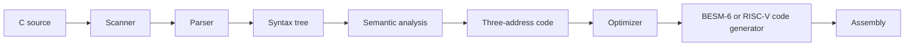

# A C11 Compiler: BESM-6 and RISC-V

This is a compiler for the C programming language (the 2011 standard, C11), small enough
to read from top to bottom. One machine-independent front end feeds two code generators:

* **BESM-6** — a Soviet mainframe designed in the 1960s. This compiler was used to port
  **Unix v7 to the BESM-6**; that port lives in
  [besm6/v7besm](https://github.com/besm6/v7besm). Programs also run under the
  [Dubna](https://github.com/besm6/dubna) monitor.
* **RISC-V** — 64-bit RV64IMFD with the standard LP64D calling convention, so its code
  links with code compiled by clang. Programs run on bare-metal qemu. See
  [docs/Riscv_Backend.md](docs/Riscv_Backend.md).

The two machines could hardly be further apart, and that is the point: the second one
proves that the front end is not tied to the first.

## Why a 1960s mainframe is hard to compile C for

C was designed around a machine that addresses individual bytes. The BESM-6 does not have
one. Its differences are not cosmetic — they reach into nearly every part of the compiler:

* **Memory is addressed in 48-bit words, not bytes.** There is no instruction to load or
  store a single byte. To read one character, the compiler must load the whole word that
  contains it and then shift and mask the bits it wants.
* **Six characters fit in one word.** So `sizeof(int)` is 6, not 4. A `char *` cannot be a
  plain address; it has to carry both a word address and which of the six positions inside
  that word it points at.
* **Floating-point numbers are not IEEE 754.** The machine has its own format, so the
  compiler cannot borrow the host computer's arithmetic.
* **The machine has no multiply-by-integer, no divide, and no unsigned arithmetic.** These
  are supplied by a small library of hand-written helper routines that the compiler calls.
* **Text is not ASCII.** The BESM-6 uses a Russian character set called KOI-7, so string
  literals are translated as they are compiled.

These are documented in detail under [docs/](#documentation) — they are the interesting
part of the project.

## How it works

A compiler is a pipeline. Each stage rewrites the program into a form a little closer to
the machine:

1. **Scanner** — splits the source text into words and symbols (*tokens*).
2. **Parser** — arranges those tokens into a tree that mirrors the structure of the
   program (a *syntax tree*).
3. **Semantic analysis** — checks the meaning: do the types agree, does every name refer to
   something that was declared?
4. **Lowering and optimization** — rewrites the tree into a simple, machine-independent
   list of instructions called *three-address code* (TAC), then improves it: folding
   constants, deleting unreachable code, and removing pointless copies and stores.
5. **Code generation** — turns TAC into assembly for the target machine, then polishes it
   with a *peephole* pass that spots and shortens wasteful instruction sequences. The
   RISC-V generator also allocates registers by graph colouring.



Stages 1–4 are machine-independent; a machine plugs in at stage 5. Two code generators
exist, for BESM-6 and RISC-V; sketches for other architectures remain under `backend/`.

The BESM-6 code generator speaks three different BESM-6 assembly languages, because three
different assemblers exist for the machine: **`b6as`** (the Unix one, and the default),
**Madlen** (for the Dubna monitor), and **Bemsh** (the original 1967 autocode, whose
mnemonics are Russian).

## Three programs

The compiler is not one binary but three, run one after another:

| Program    | Reads         | Writes                      |
| ---------- | ------------- | --------------------------- |
| `parse`    | C source      | a syntax tree (`.ast`)      |
| `lower`    | a syntax tree | three-address code (`.tac`) |
| `genbesm`  | TAC           | BESM-6 assembly             |
| `genriscv` | TAC           | RISC-V assembly             |

`lower` takes the target with `-t` (`besm6` by default, or `riscv64`): sizes, alignment
and the meaning of `long` differ between the two.

Splitting them apart makes each stage easy to inspect on its own: every program can also
print its output as readable YAML text (`--yaml`) or as a diagram for
[Graphviz](https://graphviz.org/) (`--dot`).

There is no preprocessor in this repository. If your program uses `#include` or `#define`,
run it through your system compiler's preprocessor first: `cc -E -nostdinc -Ilibc/besm6/include -Ilibc/common/include prog.c` (for RISC-V,
`-Ilibc/riscv/include` in place of the BESM-6 directory).

## Getting started

**You need** CMake 3.10 or newer and a C11 compiler. Building the tests also needs a C++17
compiler and, the first time you configure, network access so CMake can download
GoogleTest. The RISC-V runtime and run tests need a RISC-V clang, `ld.lld` and
`qemu-system-riscv64` (on macOS: Homebrew `llvm`, `lld` and `qemu`); without them those
tests are skipped.

```bash
make            # build the compiler and the runtime library
make run        # build and run the full test suite
make install    # install (see below)
```

Compile a small program by hand and look at each stage:

```bash
./build/parse hello.c hello.ast          # C source  -> syntax tree
./build/lower hello.ast hello.tac        # tree      -> three-address code
./build/backend/genbesm hello.tac hello.s   # TAC    -> BESM-6 assembly
```

For RISC-V, lower for that target and use its code generator; how to assemble, link and
run the result under qemu is in [docs/Riscv_Backend.md](docs/Riscv_Backend.md):

```bash
./build/lower -t riscv64 hello.ast hello.tac
./build/backend/genriscv hello.tac hello.s
```

To read what happened at any stage, ask for YAML instead:

```bash
./build/parse --yaml hello.c hello.yaml
./build/lower --yaml hello.ast hello.yaml
```

Or draw it as a picture, if you have Graphviz:

```bash
./build/parse --dot hello.c hello.dot
dot -Tpng hello.dot -o hello.png
```

## What gets installed

`make install` puts everything into `~/.local`. (To choose your own location:
`cmake --install build --prefix /opt/vcc`.)

| Installed as                   | What it is                                   |
| ------------------------------ | -------------------------------------------- |
| `bin/vparse`                   | the parser                                   |
| `bin/vlower`                   | the analyzer and optimizer                   |
| `bin/vgenbesm6`                | the BESM-6 code generator                    |
| `share/besm6/lib/libc.bin`     | C library for the Dubna monitor (Madlen)     |
| `share/besm6/lib/libbem.bin`   | C library for the Dubna monitor (Bemsh)      |
| `share/besm6/lib/libruntime.a` | the helper routines the generated code calls |
| `share/besm6/include/*.h`      | the ten headers that describe this compiler  |
| `bin/vgenriscv64`              | the RISC-V code generator                    |
| `share/riscv64/lib/`           | RISC-V `crt0.o`, `libc.a`, linker script     |
| `share/riscv64/include/*.h`    | the RISC-V C headers                         |

Those ten BESM-6 headers — `besm6.h`, `float.h`, `iso646.h`, `limits.h`, `stdalign.h`,
`stdarg.h`, `stdbool.h`, `stddef.h`, `stdint.h`, `stdnoreturn.h` — describe the compiler
itself: how big its types are, how variable arguments work, what its built-in functions
do. So they ship with it.

The rest of the C library — `stdio.h`, `string.h`, `stdlib.h`, `math.h` and the code
behind them — comes from the **v7besm** project, which owns the real Unix C library for
this machine. This repository builds its own smaller copy (`libc0.a`) so that its tests
can run standalone, but deliberately does not install it. RISC-V has no such project, so
its whole library and every header are installed.

## What the runtime provides

Programs compiled here have a usable C library: `printf`, `sprintf` and `snprintf`;
`puts`, `putchar` and console input; the whole of `<string.h>` and the `mem*` family;
`atoi`; `exit`; math helpers (`fabs`, `fmin`, `fmax`, `fma`, `modf`, `frexp`, `ldexp`);
and working variable arguments (`<stdarg.h>`).

On BESM-6, `malloc` and friends are available on the Unix path only — the allocator needs
a heap laid out by the Unix linker, which the Dubna monitor does not provide. RISC-V has
the same library on bare-metal qemu, a simple `malloc`, and `long double` as IEEE
binary128 in software.

## Documentation

Start with [docs/Learn_From_This_Project.md](docs/Learn_From_This_Project.md) if you want
the guided tour, or [docs/Technical_Reference.md](docs/Technical_Reference.md) if you want
the map of the source tree.

### About the machine

| Document                                                               | What it covers                                                     |
| ---------------------------------------------------------------------- | ------------------------------------------------------------------ |
| [docs/Besm6_Data_Representation.md](docs/Besm6_Data_Representation.md) | How every C type is stored in a 48-bit word                        |
| [docs/Besm6_Instruction_Set.md](docs/Besm6_Instruction_Set.md)         | The BESM-6 instruction set                                         |
| [docs/Besm6_Calling_Conventions.md](docs/Besm6_Calling_Conventions.md) | How functions call each other: registers, `b/save`, `b/ret`        |
| [docs/KOI7_Encoding.md](docs/KOI7_Encoding.md)                         | The KOI-7 character set and the ASCII conversion the compiler does |
| [docs/Madlen.md](docs/Madlen.md)                                       | The Madlen assembler (Dubna monitor)                               |
| [docs/Bemsh.md](docs/Bemsh.md)                                         | Bemsh, the original 1967 autocode with Russian mnemonics           |
| [docs/Besm6_Unix_Assembler.md](docs/Besm6_Unix_Assembler.md)           | `b6as`, the Unix assembler                                         |

### About the compiler

| Document                                                           | What it covers                                              |
| ------------------------------------------------------------------ | ----------------------------------------------------------- |
| [docs/Technical_Reference.md](docs/Technical_Reference.md)         | Source layout, every component, the build system, the tests |
| [docs/Learn_From_This_Project.md](docs/Learn_From_This_Project.md) | A walkthrough of how the compiler was built and why         |
| [docs/Tests_From_The_Book.md](docs/Tests_From_The_Book.md)         | How the test suite is organized, for newcomers              |
| [docs/C_Grammar.md](docs/C_Grammar.md)                             | The C grammar, and how it maps onto the hand-written parser |
| [docs/Type_Coercion.md](docs/Type_Coercion.md)                     | C's rules for mixing types in an expression                 |
| [docs/Type_Sizes_Alignment.md](docs/Type_Sizes_Alignment.md)       | Type sizes and alignment, per machine                       |
| [docs/TAC_Optimization.md](docs/TAC_Optimization.md)               | The machine-independent optimizer passes                    |
| [docs/Peephole_Rewrites.md](docs/Peephole_Rewrites.md)             | The BESM-6 peephole pass and every rewrite it performs      |
| [docs/Riscv_Backend.md](docs/Riscv_Backend.md)                     | The RISC-V code generator, and running programs under qemu  |
| [docs/Memory_Allocation.md](docs/Memory_Allocation.md)             | `xalloc`, the compiler's own allocator                      |
| [docs/String_Map.md](docs/String_Map.md)                           | `string_map`, the key-value store used for symbol tables    |
| [docs/Word_Oriented_IO.md](docs/Word_Oriented_IO.md)               | How the `.ast` and `.tac` binary files are written          |

### About the target C library

| Document                                                         | What it covers                                                          |
| ---------------------------------------------------------------- | ----------------------------------------------------------------------- |
| [docs/Standard_Include_Files.md](docs/Standard_Include_Files.md) | The C11 headers shipped for the BESM-6                                  |
| [docs/Besm6_Runtime_Library.md](docs/Besm6_Runtime_Library.md)   | The helper routines the generated code calls                            |
| [docs/Besm6_Intrinsics.md](docs/Besm6_Intrinsics.md)             | `<besm6.h>`: reaching machine instructions that C has no way to express |
| [docs/Frexp_Ldexp.md](docs/Frexp_Ldexp.md)                       | `frexp` and `ldexp`, written directly in BESM-6 assembly                |

## License

MIT. See [LICENSE](LICENSE).

Copyright (c) 2025 besm6
